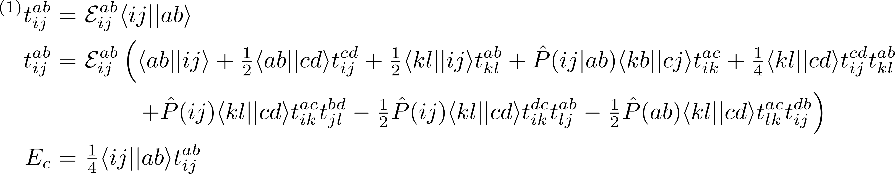

# meinsum
## electronic structure code for minimalists

A small collection of python modules for programming electronic structure theories in simple spin-orbital form.  Primarily designed to be used with [psi4](http://www.psicode.org/), building on the functionality of [psi4numpy](https://github.com/dgasmith/psi4numpy).  The tensor contraction modules ([index](https://github.com/avcopan/meinsum/blob/master/meinsum/index.py) and [block](https://github.com/avcopan/meinsum/blob/master/meinsum/block.py)), permutation module ([permutation](https://github.com/avcopan/meinsum/blob/master/meinsum/permutation.py)), and DIIS module ([diis](https://github.com/avcopan/meinsum/blob/master/meinsum/diis.py)) can be used independently.  The goal is to allow one to write code that looks as much as possible like the equations to be implemented.

Requires [tensorshuffle](https://github.com/avcopan/tensorshuffle) module.

Spin-orbital codes are not intended for production-level efficiency, but you will see a substantial speed-up if your versions of `numpy` and `scipy` make use of an optimized BLAS library (e.g. [openblas](http://www.openblas.net/)) since the contractions are wrapped around `numpy.tensordot`.  You can check your BLAS/LAPACK linkage by running `python -c 'import numpy; numpy.__config__.show()'` in a terminal.

Probably most useful is the index module, which allows one to associate index characters with specific contraction ranges.
```python
from meinsum.index import Index

indx = Index(dim, 'pqrs')
indx.add_index_range(   0, nocc, 'ijkl')
indx.add_index_range(nocc,  dim, 'abcd')
```
Using this `Index` object, one can solve for the coupled-cluster doubles (CCD) energy as
```python
t = indx.einsum('ijab', (Ep,"ijab"), (g,"ijab"))

for i in range(maxiter):

  t = Ep * indx.meinsums('ijab',
             [ 1.  , I         , (g,"abij")                        ],
             [ 1./2, I         , (g,"abcd"), (t,"ijcd")            ],
             [ 1./2, I         , (g,"klij"), (t,"klab")            ],
             [ 1.  , P("ij|ab"), (g,"kbcj"), (t,"ikac")            ],
             [ 1./4, I         , (g,"klcd"), (t,"ijcd"), (t,"klab")],
             [ 1.  , P("ij")   , (g,"klcd"), (t,"ikac"), (t,"jlbd")],
             [-1./2, P("ij")   , (g,"klcd"), (t,"ikdc"), (t,"ljab")],
             [-1./2, P("ab")   , (g,"klcd"), (t,"lkac"), (t,"ijdb")])

E = 1./4 * indx.einsum('', (g,"ijab"), (t,"ijab"))
```
where the **P** operators are provided by the permutation module.
The corresponding equations are


(see Shavitt and Bartlett *Many-Body Methods* for details).  The permutation module supports arbitrary permutations of the form **P(i/jk|a/bc...)** as defined by Shavitt and Bartlett.  This module is especially useful for methods like [CCSD(T)](https://github.com/avcopan/meinsum/blob/master/examples/ccsdt/parentheses.py).

Example codes and input files are provided.
These can be run as `psi4 input.dat` with a recent version of [psi4](https://github.com/psi4/psi4public), once this directory has been added to your PYTHONPATH (e.g. `export PYTHONPATH=/path/to/meinsum/`).

This is primarily intended for my own personal use, but comments and suggestions are welcome.

===
<sub>
`meinsum` Copyright &copy; 2015 Andreas V. Copan

<sub>
This program is free software: you can redistribute it and/or modify
it under the terms of the GNU General Public License as published by
the Free Software Foundation, either version 3 of the License, or
(at your option) any later version.

<sub>
This program is distributed in the hope that it will be useful,
but WITHOUT ANY WARRANTY; without even the implied warranty of
MERCHANTABILITY or FITNESS FOR A PARTICULAR PURPOSE.  See the
GNU General Public License for more details.

<sub>
You should have received a copy of the GNU General Public License
along with this program.  If not, see <http://www.gnu.org/licenses/>.
