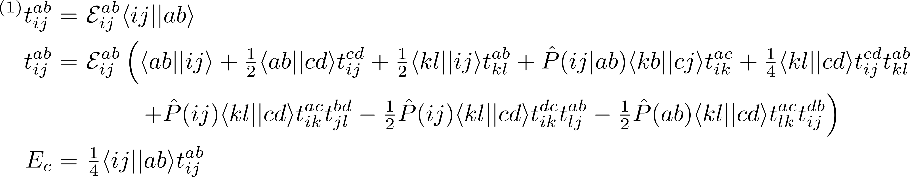

# meinsum
## simple electronic structure codes in Python

A small collection of modules for writing spin-orbital quantum chemistry codes.  Primarily designed to be used with [psi4](https://github.com/psi4/psi4public), building on the functionality introduced with [psi4numpy](https://github.com/dgasmith/psi4numpy), but the tensor contraction modules ([index](https://github.com/avcopan/meinsum/blob/master/lib/index.py) and [block](https://github.com/avcopan/meinsum/blob/master/lib/block.py)), permutation module ([permutation](https://github.com/avcopan/meinsum/blob/master/lib/permutation.py)), and DIIS module ([diis](https://github.com/avcopan/meinsum/blob/master/lib/diis.py)) can be used independently as well.  The goal is to allow one to write code that looks as much as possible like the equations of the theory.


Probably most useful is the index module, which allows one to associate index characters with specific contraction ranges.
```python
from lib.index import Index

indx = Index(dim, 'pqrs')
indx.add_index_range(   0, nocc, 'ijkl')
indx.add_index_range(nocc,  dim, 'abcd')
```
Using this Index object, one can solve for the coupled-cluster doubles (CCD) energy as
```python
t = indx.einsum('ijab', (Ep,"ijab"), (g,"ijab"))

for i in range(maxiter):

  t = Ep * indx.meinsums('ijab',
             [ 1.  , I         , (g,"abij")                        ],
             [ 1./2, I         , (g,"abcd"), (t,"ijcd")            ],
             [ 1./2, I         , (g,"klij"), (t,"klab")            ],
             [ 1.  , P("ij|ab"), (g,"kbcj"), (t,"ikac")            ],
             [ 1./4, I         , (g,"klcd"), (t,"ijcd"), (t,"klab")],
             [ 1.  , P("ij")   , (g,"klcd"), (t,"ikac"), (t,"jlbd")],
             [-1./2, P("ij")   , (g,"klcd"), (t,"ikdc"), (t,"ljab")],
             [-1./2, P("ab")   , (g,"klcd"), (t,"lkac"), (t,"ijdb")])

E = 1./4 * indx.einsum('', (g,"ijab"), (t,"ijab"))
```
where the *P* operators are provided by the permutation module, which supports arbitrary permutations of the form *P(i/jk|a/bc...)* as defined in Shavitt and Bartlett *Many-Body Methods*.
The corresponding equations are

(see Shavitt and Bartlett for details).

